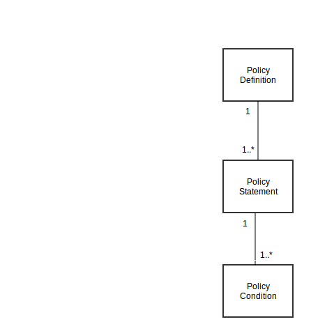

.. FlexSwitchL3 documentation master file, created by
   sphinx-quickstart on Mon May 16 11:13:19 2016.
   You can adapt this file completely to your liking, but it should at least
   contain the root `toctree` directive.

Policy Manager Implementaion
============================
   
    RIB also doubles in as policy mamager. Policy objects are configured and organized in a hierarchical fashion as follows:

A policy definition object contains one or more policy statements which in turn contains one or more policy conditions.
These are the steps for configuring policies:

#. 

    create a policy condition object.
	
         A policy condition object is used to define any matching condition/filter. The condition types can be to match destination/source  IP prefix or to match a route protocol etc. 
#.

    create a policy statement object which uses the condition objects
	
        Policy statement object is a set of conditions and has a matchtype attribute which indicates whether all or any of the conditions        need to me matched for the statement to be a hit.	
#.
	
    create a policy definition object which uses statement objects.
	
        Policy definition objects are defined as set of statements ordered with a priority. Priority of the statement dictates the order of evaluation of the statement. Policy object itself also has a priority attribute which dictates the order of evaluation of the policy.
	
.. toctree::
   :maxdepth: 4

    Config Examples <policyconfig>
